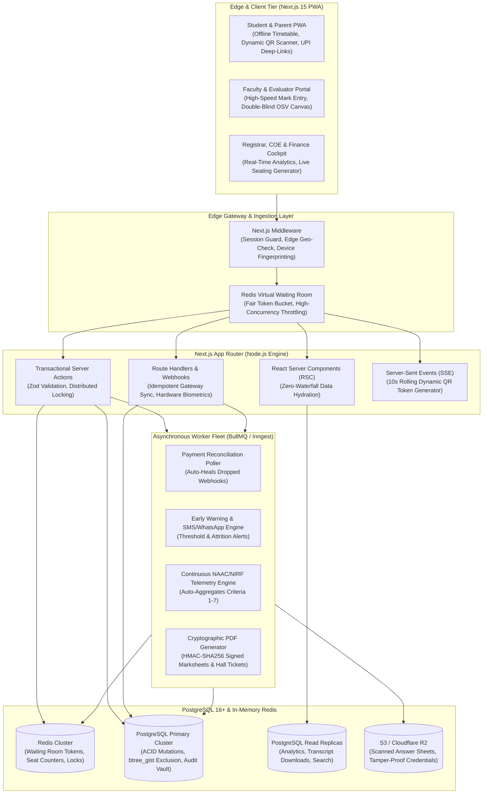
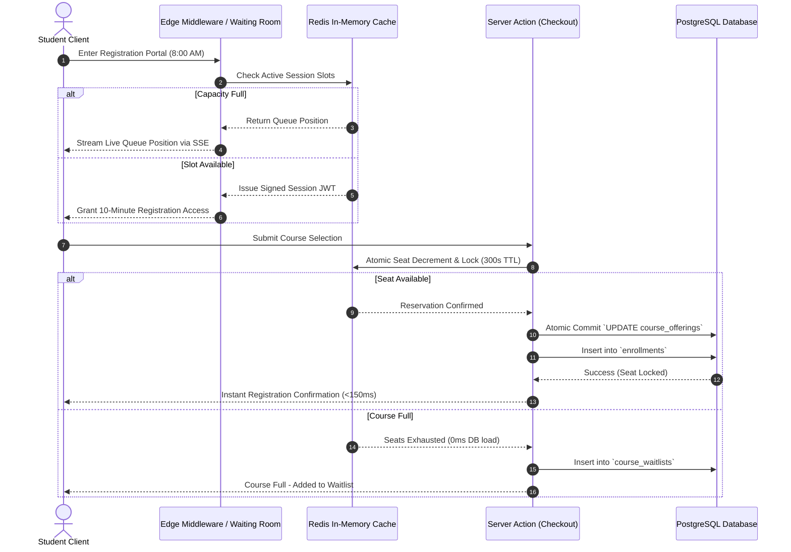
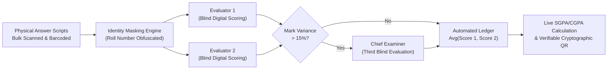

# Product Requirements Document (PRD) v2.0
## Enterprise College ERP: High-Concurrency & Anti-Fraud Architecture
**Technology Stack:** Next.js 15+ (App Router, Server Components, Server Actions), PostgreSQL 16+ & Redis  
**Document Ref:** PRD-ENTERPRISE-v2.0  
**Status:** Architecture Complete & Implementation Ready  

---

## 1. Executive Vision & Competitive Gap Rectification

### 1.1 The Context
Higher education institutions worldwide rely on legacy ERPs—primarily **Ellucian Banner**, **Oracle PeopleSoft**, **Workday Student**, and **TCS iON**. An exhaustive competitive audit revealed that despite multi-million-dollar license fees, these platforms suffer from systemic failures:
- **Registration Day Crashes:** Row-level lock contention and database exhaustion during 8:00 AM elective course add/drop windows.
- **Proxy Attendance Epidemic:** Static QR codes and paper roll calls allow up to 25% proxy check-ins.
- **Degree Audit Blindness:** Rigid credit counters incapable of handling modern interdisciplinary degrees, "What-If" major/minor simulations, and India's NEP 2020 Multi-Entry/Multi-Exit & Academic Bank of Credits (ABC / APAAR ID).
- **Exam Insecurity & Evaluation Delays:** Primitive seating arrangements leading to copying; manual spreadsheet marks tabulation taking 45–60 days; vulnerable paper credentials without cryptographic validation.
- **Payment Reconciliation Traps:** Dropped payment webhooks leave students marked "Unpaid" despite money being deducted, unjustly blocking them from examination hall tickets.
- **Accreditation Panic:** 6-month administrative paralysis manually collating NAAC, NBA, and NIRF Self-Study Reports (SSR).

### 1.2 The v2.0 Solution
A modern, zero-compromise, mobile-first **Enterprise College ERP Platform** designed from the ground up on **Next.js 15+ (App Router)** and **PostgreSQL 16+**. It incorporates distributed queue tokenization, cryptographic dynamic attendance verification, graph-based degree audit engines, automated double-blind examination evaluation, and real-time accreditation telemetry.

---

## 2. System Architecture & High-Concurrency Topology



---

## 3. The 10 Gap-Rectifying Functional Modules

### Module 1: High-Concurrency Course Registration & Virtual Waiting Room
- **Virtual Waiting Room Engine:** During peak add/drop registration, incoming traffic is intercepted at the Next.js Edge Middleware. Students receive a cryptographically signed queue token (`HMAC-SHA256` containing `student_id`, `queue_position`, and `timestamp`). A Redis sliding-window token bucket throttles active registration sessions to an optimal capacity ($N=500$ concurrent checkouts), preventing database overload.
- **In-Memory Atomic Seat Decrements:** Elective course capacity is cached in Redis. When a student adds an elective to their cart, Redis executes an atomic decrement script:
  ```lua
  local seats = redis.call('GET', KEYS[1])
  if tonumber(seats) > 0 then
      redis.call('DECR', KEYS[1])
      redis.call('SETEX', KEYS[2], 300, ARGV[1]) -- 5-minute reservation
      return 1
  end
  return 0
  ```
- **Deadlock-Free Database Commits:** When the cart checks out via a Server Action, PostgreSQL acquires locks in deterministic sorted UUID order, executing an optimistic atomic update:
  ```sql
  UPDATE course_offerings 
  SET enrolled_count = enrolled_count + 1 
  WHERE id = $1 AND enrolled_count < max_capacity 
  RETURNING id, enrolled_count;
  ```
- **Automated Waitlist Escalation:** If a reserved seat expires without payment/confirmation, the Redis reservation drops, incrementing the counter and triggering an automated notification to the top-ranked waitlisted student with a 2-hour reservation window.



---

### Module 2: Anti-Proxy Dynamic QR & Geofenced Attendance Engine
- **Rolling Cryptographic QR Code (TOTP Protocol):** The faculty dashboard projects a dynamic QR code that regenerates every 10 seconds via Server-Sent Events (SSE). The QR payload encodes:
  $$\text{QR Token} = \text{HMAC-SHA256}\Big(\text{session\_id} \parallel \text{rounded\_time\_step} \parallel \text{room\_secret}\Big)$$
  Screenshots sent across WhatsApp expire in 10 seconds, rendering proxy check-ins impossible.
- **Haversine Geofencing Verification:** The student PWA captures device coordinates at the instant of scan. The server computes the great-circle distance between the student and the classroom centroid:
  $$d = 2R \arcsin \left( \sqrt{\sin^2\left(\frac{\Delta \text{lat}}{2}\right) + \cos(\text{lat}_1)\cos(\text{lat}_2)\sin^2\left(\frac{\Delta \text{lng}}{2}\right)} \right) \le 25\text{ meters}$$
  Scans originating outside the classroom geofence are rejected with an `OUT_OF_BOUNDS` flag.
- **Biometric WebAuthn Binding:** The student PWA binds the student account to the physical hardware device via WebAuthn (Touch ID / Face ID / Fingerprint). One device cannot mark attendance for multiple student accounts.
- **Hardware Integration Webhook:** Native support for RFID turnstiles and biometric access doors streaming punch records to `/api/webhooks/biometric`.

---

### Module 3: Graph-Based Degree Audit & NEP 2020 Multi-Entry/Exit Engine
- **Directed Acyclic Graph (DAG) Curriculum Engine:** Models complex degree requirements as a directed graph of credit buckets:
  - **Core Disciplines:** Mandatory foundation courses.
  - **Discipline Electives:** Specialized department electives.
  - **Open Interdisciplinary Electives:** Cross-department courses (e.g., Computer Science Major taking Cognitive Psychology).
  - **Ability & Skill Enhancement Courses (AEC/SEC):** Hands-on technical or communication credits.
- **NEP 2020 Multi-Entry / Multi-Exit Life Cycle:**
  - **Exit Year 1 (40 Credits):** Automatic eligibility check and issuance of **Undergraduate Certificate**.
  - **Exit Year 2 (80 Credits):** Automatic issuance of **Undergraduate Diploma**.
  - **Exit Year 3 (120 Credits):** Automatic issuance of **Bachelor's Degree**.
  - **Exit Year 4 (160 Credits):** Automatic issuance of **Bachelor's Degree with Honors / Research**.
- **Real-Time "What-If" Simulation:** Students can simulate switching majors or declaring minors. The system dynamically evaluates:
  $$\text{Credits Transferred} = \sum \Big(\text{Completed Courses} \cap \text{New Program Curriculum}\Big)$$
  It outputs the exact graduation delta (e.g., "+1 additional semester required, 12 remaining credits").
- **DigiLocker & APAAR / ABC Sync:** Automated two-way synchronization with the National Academic Depository (NAD), registering earned credits directly to the student's Academic Bank of Credits (ABC) ID.

---

### Module 4: Examination Cell (COE), Anti-Cheating Seating & Double-Blind OSV
- **Algorithmic Anti-Cheating Seating Allocator:** An automated graph-coloring algorithm assigns students into examination halls enforcing strict adjacency rules:
  $$\forall \text{ adjacent or diagonal seats } (A, B): \text{CoursePaper}(A) \ne \text{CoursePaper}(B) \land \text{Dept}(A) \ne \text{Dept}(B)$$
- **Double-Blind On-Screen Evaluation (OSV):**
  1. Physical answer scripts are barcoded and digitally scanned into high-resolution multi-page PDFs.
  2. The student's identity (Name, Roll Number) is cryptographically masked.
  3. Evaluator 1 and Evaluator 2 grade the digital script independently via an interactive web annotation canvas.
  4. If marks variance $|\text{Score}_1 - \text{Score}_2| > 15\%$, the script is flagged for automatic arbitration by a Senior Third Evaluator.
  5. The final mark ledger is compiled automatically without manual spreadsheet re-entry.
- **Tamper-Proof Cryptographic Marksheets:** Marksheets and degree certificates feature a public-key verifiable QR code containing an `HMAC-SHA256` signature of the student's grades, registration number, and graduation date. Anyone can verify document authenticity at `/verify/[hash]` without database access.



---

### Module 5: Resilient Financial Engine, Webhook Idempotency & Provisional Exam Pass
- **Idempotent Multi-Gateway Pipeline:** Integrates Razorpay, Stripe, Cashfree, and UPI. All payment updates are keyed by an idempotent hash:
  $$\text{IdempotencyKey} = \text{SHA256}(\text{student\_id} \parallel \text{fee\_structure\_id} \parallel \text{semester} \parallel \text{amount})$$
  Duplicate webhook callbacks from payment gateways are safely recognized and ignored.
- **Automated Webhook Healing Cron Worker:** A BullMQ background worker polls payment gateway APIs for transactions stuck in `PENDING` status for $>5$ minutes, resolving bank-side successful deductions within 120 seconds.
- **48-Hour Provisional Exam Pass Policy:** If a payment is in `PENDING_RECONCILIATION` on the eve of an examination, the system issues a temporary digitally signed **48-Hour Provisional Hall Ticket**, ensuring no student is barred from exams due to third-party bank gateway downtime.
- **Smart Installments & UPI Auto-Debit:** Enables parents to subscribe to automated monthly or semester-based UPI Autopay / e-Mandate fee installments.

---

### Module 6: Algorithmic Timetable Solver & Clash-Free Constraints
- **Database-Level Exclusion Constraints:** Uses PostgreSQL `btree_gist` with temporal ranges (`tsrange`) to mathematically prevent room and faculty double-booking:
  ```sql
  CONSTRAINT no_room_clash EXCLUDE USING gist (
      room_number WITH =,
      day_of_week WITH =,
      tsrange(('2000-01-01 ' || start_time)::timestamp, ('2000-01-01 ' || end_time)::timestamp) WITH &&
  );
  ```
- **Constraint Satisfaction Solver (CSP):** Generates optimal campus-wide schedules optimizing for:
  - Zero faculty double-booking.
  - Zero room double-booking.
  - Zero student core-elective course clashes.
  - Compact student schedules (minimizing hollow 3-hour gaps).
  - Consolidated faculty research blocks.

---

### Module 7: Early Warning & Predictive Student Drop-Out Alerts
- **Predictive Academic Risk Scoring (ARS):** Evaluated weekly for every enrolled student:
  $$\text{ARS} = 0.40 \times (100 - \text{Attn}\%) + 0.35 \times (100 - \text{CIAScore}\%) + 0.15 \times \text{LMSInactivity} + 0.10 \times \text{FeeDuesPenalty}$$
- **Automated Intervention Pipeline:**
  - **ARS 50–64 (Moderate Risk):** Automated notification to student with suggested peer-tutoring hours.
  - **ARS $\ge 65$ (High Risk):** Automatic generation of an **Intervention Case** assigned to the student's Faculty Mentor. Mandatory counseling notes must be logged within 7 days. Gentle progress status alerts sent to parents.

---

### Module 8: Continuous Accreditation Telemetry (NAAC / NBA / NIRF)
- **Continuous Background Aggregation:** Replaces the 6-month accreditation scramble with real-time telemetry:
  - **Criterion 1 (Curricular Aspects):** Live elective selection stats, student feedback ratings, curriculum revision frequencies.
  - **Criterion 2 (Teaching-Learning):** Live student-to-teacher ratio (STR), continuous internal assessment rubrics, pass percentages.
  - **Criterion 3 (Research & Innovations):** Direct DOI integration with Scopus and Web of Science pulling faculty publications, citations, and patents into faculty API dossiers.
  - **Criterion 5 (Student Support):** Real-time scholarship disbursals and anti-ragging grievance SLA turnaround times.
- **One-Click SSR Exporter:** Directly renders fully populated official NAAC Self-Study Report (SSR) tables in Excel and PDF formats.

---

### Module 9: LMS-Lite & LTI 1.3 Advantage Protocol
- **LTI 1.3 Advantage Compatibility:** Acts as both Tool Provider and Tool Platform, allowing seamless integration with Canvas, Moodle, and Blackboard.
- **Bi-Directional Grade Synchronization:** Continuous assessment assignment scores, quiz results, and lab submissions sync directly into the COE marks ledger via background jobs, eliminating manual faculty marks re-entry.

---

### Module 10: Unified Mobile-First PWA & Offline Engine
- **Next.js 15 Progressive Web App:** Full touch-first responsiveness with sub-150ms screen transitions.
- **Offline Caching:** Service workers cache weekly timetables, digital student ID cards with offline-verifiable QR signatures, and exam hall tickets in client-side IndexedDB for instant access without an active internet connection.

---

## 4. Enhanced PostgreSQL Database Schema (DDL)

```sql
-- Extensions
CREATE EXTENSION IF NOT EXISTS "uuid-ossp";
CREATE EXTENSION IF NOT EXISTS "pgcrypto";
CREATE EXTENSION IF NOT EXISTS "btree_gist";
CREATE EXTENSION IF NOT EXISTS "pg_trgm";

-- User Roles
CREATE TYPE user_role AS ENUM (
    'SUPER_ADMIN', 'REGISTRAR', 'DEAN', 'HOD', 
    'FACULTY', 'STUDENT', 'PARENT', 'COE', 
    'FINANCE_OFFICER', 'LIBRARIAN', 'WARDEN', 'MENTOR'
);

-- Virtual Waiting Room & Registration Tokens
CREATE TABLE registration_queue_tokens (
    id UUID PRIMARY KEY DEFAULT gen_random_uuid(),
    student_id UUID NOT NULL,
    token_hash VARCHAR(64) UNIQUE NOT NULL,
    granted_at TIMESTAMPTZ NOT NULL DEFAULT NOW(),
    expires_at TIMESTAMPTZ NOT NULL,
    is_consumed BOOLEAN NOT NULL DEFAULT FALSE
);

-- Degree Requirements (DAG-based Curriculum Structure)
CREATE TYPE credit_bucket_type AS ENUM (
    'CORE', 'DISCIPLINE_ELECTIVE', 'OPEN_ELECTIVE', 
    'ABILITY_ENHANCEMENT', 'SKILL_ENHANCEMENT', 'MANDATORY_NON_CREDIT'
);

CREATE TABLE degree_requirements (
    id UUID PRIMARY KEY DEFAULT gen_random_uuid(),
    program_id UUID NOT NULL REFERENCES programs(id) ON DELETE CASCADE,
    bucket_type credit_bucket_type NOT NULL,
    required_credits INT NOT NULL,
    min_courses INT NOT NULL,
    nep_exit_level INT NOT NULL DEFAULT 4, -- 1=Cert, 2=Dip, 3=Degree, 4=Honors
    prerequisite_rules JSONB DEFAULT '{}'::jsonb
);

-- Academic Bank of Credits (ABC / APAAR Sync)
CREATE TABLE abc_credit_records (
    id UUID PRIMARY KEY DEFAULT gen_random_uuid(),
    student_id UUID NOT NULL REFERENCES student_profiles(id) ON DELETE CASCADE,
    apaar_id VARCHAR(50) NOT NULL,
    course_id UUID NOT NULL REFERENCES courses(id),
    academic_year VARCHAR(20) NOT NULL,
    credits_earned INT NOT NULL,
    grade_obtained VARCHAR(5) NOT NULL,
    digilocker_sync_status VARCHAR(20) NOT NULL DEFAULT 'PENDING',
    synced_at TIMESTAMPTZ,
    UNIQUE(apaar_id, course_id, academic_year)
);

-- Dynamic Rotating QR Code for Anti-Proxy Attendance
CREATE TABLE dynamic_attendance_tokens (
    id UUID PRIMARY KEY DEFAULT gen_random_uuid(),
    offering_id UUID NOT NULL REFERENCES course_offerings(id) ON DELETE CASCADE,
    token_hash VARCHAR(64) UNIQUE NOT NULL,
    generated_at TIMESTAMPTZ NOT NULL DEFAULT NOW(),
    expires_at TIMESTAMPTZ NOT NULL,
    classroom_lat NUMERIC(9, 6) NOT NULL,
    classroom_lng NUMERIC(9, 6) NOT NULL,
    max_radius_meters INT NOT NULL DEFAULT 25
);

-- Examination Anti-Cheating Seating Allocation
CREATE TABLE exam_seating_allocations (
    id UUID PRIMARY KEY DEFAULT gen_random_uuid(),
    exam_id UUID NOT NULL REFERENCES assessments(id) ON DELETE CASCADE,
    student_id UUID NOT NULL REFERENCES student_profiles(id) ON DELETE CASCADE,
    hall_number VARCHAR(50) NOT NULL,
    row_num INT NOT NULL,
    col_num INT NOT NULL,
    seat_label VARCHAR(20) NOT NULL,
    UNIQUE(exam_id, hall_number, row_num, col_num),
    UNIQUE(exam_id, student_id)
);

-- Double-Blind On-Screen Evaluation
CREATE TABLE on_screen_evaluation_scripts (
    id UUID PRIMARY KEY DEFAULT gen_random_uuid(),
    assessment_id UUID NOT NULL REFERENCES assessments(id) ON DELETE CASCADE,
    anonymous_barcode VARCHAR(100) UNIQUE NOT NULL, -- Masked student identity
    student_id UUID NOT NULL REFERENCES student_profiles(id),
    scanned_pdf_url TEXT NOT NULL,
    evaluator_1_id UUID REFERENCES users(id),
    evaluator_1_score NUMERIC(5, 2),
    evaluator_2_id UUID REFERENCES users(id),
    evaluator_2_score NUMERIC(5, 2),
    arbiter_id UUID REFERENCES users(id),
    arbiter_score NUMERIC(5, 2),
    final_score NUMERIC(5, 2),
    status VARCHAR(30) NOT NULL DEFAULT 'AWAITING_FIRST_EVALUATION'
);

-- Fee Payment Reconciliation & Provisional Passes
CREATE TABLE provisional_hall_tickets (
    id UUID PRIMARY KEY DEFAULT gen_random_uuid(),
    student_id UUID NOT NULL REFERENCES student_profiles(id),
    exam_id UUID NOT NULL REFERENCES assessments(id),
    utr_reference_number VARCHAR(100) NOT NULL,
    granted_by UUID REFERENCES users(id),
    granted_at TIMESTAMPTZ NOT NULL DEFAULT NOW(),
    expires_at TIMESTAMPTZ NOT NULL, -- 48 hours validity
    is_reconciled BOOLEAN NOT NULL DEFAULT FALSE
);

-- Early Warning System & Academic Risk Scores
CREATE TABLE student_risk_indicators (
    id UUID PRIMARY KEY DEFAULT gen_random_uuid(),
    student_id UUID NOT NULL REFERENCES student_profiles(id) ON DELETE CASCADE,
    calculation_date DATE NOT NULL,
    attendance_pct NUMERIC(5, 2) NOT NULL,
    cia_score_pct NUMERIC(5, 2) NOT NULL,
    lms_activity_score NUMERIC(5, 2) NOT NULL,
    composite_risk_score NUMERIC(5, 2) NOT NULL, -- 0 to 100
    risk_level VARCHAR(20) NOT NULL CHECK (risk_level IN ('LOW', 'MODERATE', 'HIGH', 'CRITICAL')),
    mentor_notified BOOLEAN NOT NULL DEFAULT FALSE,
    mentor_action_logged TEXT,
    created_at TIMESTAMPTZ NOT NULL DEFAULT NOW(),
    UNIQUE(student_id, calculation_date)
);

-- NAAC / NIRF Continuous Telemetry Metrics Cache
CREATE TABLE naac_telemetry_cache (
    id UUID PRIMARY KEY DEFAULT gen_random_uuid(),
    academic_year VARCHAR(20) NOT NULL,
    criterion_number INT NOT NULL CHECK (criterion_number BETWEEN 1 AND 7),
    metric_code VARCHAR(50) NOT NULL, -- e.g., '1.2.1', '2.4.2'
    computed_data JSONB NOT NULL,
    last_computed_at TIMESTAMPTZ NOT NULL DEFAULT NOW(),
    UNIQUE(academic_year, metric_code)
);
```

---

## 5. Implementation Roadmap (Phased Execution)

| Milestone | Core Deliverables | Timeline |
| :--- | :--- | :--- |
| **Phase 1: High-Concurrency Core & SIS** | Redis Waiting Room, Course Registration Locking, NEP 2020 Multi-Entry/Exit SIS, Student Profiles | Weeks 1–4 |
| **Phase 2: Anti-Proxy Attendance & Timetable Solver** | 10s Rolling Dynamic QR, Haversine Geofencing, `btree_gist` Exclusion Timetable Matrix | Weeks 5–8 |
| **Phase 3: Resilient Finance & Payment Webhooks** | Idempotent Multi-Gateway Processor, BullMQ Auto-Reconciliation, 48h Provisional Exam Passes | Weeks 9–12 |
| **Phase 4: COE, Anti-Cheating Seating & Double-Blind OSV** | Seating Graph Optimizer, Barcoded Answer Masking, Dual Evaluator Canvas, Cryptographic QR Marksheets | Weeks 13–16 |
| **Phase 5: Early Warning & Accreditation Telemetry** | Predictive Risk Scoring ($0-100$), Mentor Intervention Tracker, Live 1-Click NAAC/NIRF SSR Generator | Weeks 17–20 |
| **Phase 6: Mobile PWA, LTI 1.3 Sync & Security Audit** | Offline Timetable Caching, Canvas/Moodle LTI 1.3 Sync, OWASP Hardening & 10k Concurrency Stress Test | Weeks 21–24 |

---

## 6. Success Metrics & Verification Standards

1. **Course Registration Zero-Crash Guarantee:** Successfully sustain $\ge 5,000$ simultaneous checkout requests within a 60-second window with zero deadlocks and p95 latency $<200\text{ms}$.
2. **Zero Proxy Attendance:** Eliminates proxy check-in instances through dynamic 10s token rotation and 25m geofencing.
3. **Examination Turnaround:** Reduces result compilation and transcript publishing time from 45 days down to $<72\text{ hours}$ using automated double-blind on-screen evaluation.
4. **Reconciliation Autonomy:** $99.9\%$ of dropped or delayed payment gateway transactions automatically healed within 120 seconds without human administrative intervention.
5. **Accreditation Velocity:** Reduces NAAC/NIRF data collation time from 6 months down to 1 click ($<60\text{ seconds}$).
