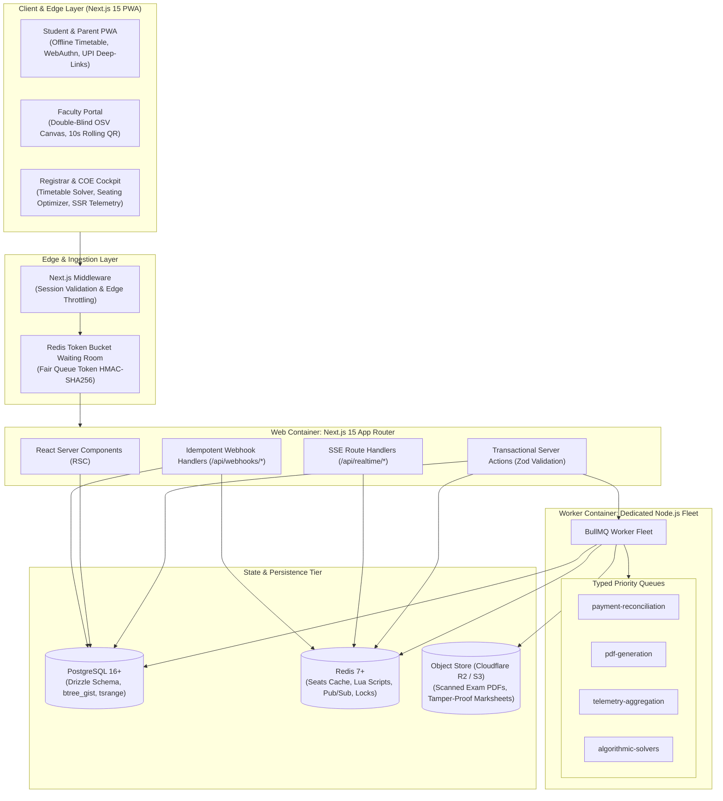
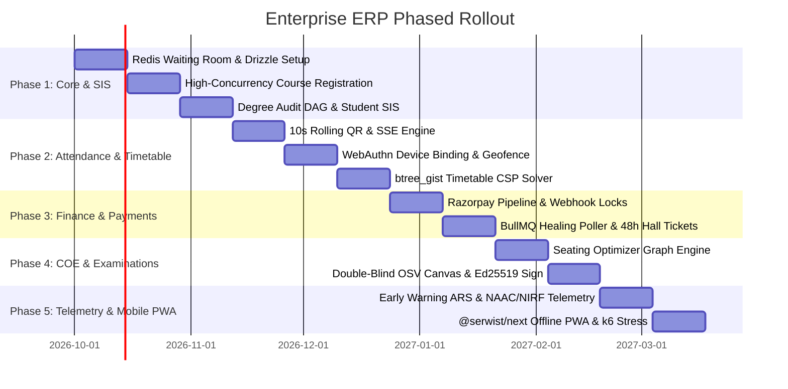

# Enterprise College ERP: Architecture Blueprint & Implementation Plan (plan.md)

**Document Ref:** ARCH-PLAN-v2.0  
**Status:** Approved & Aligned via Tech Stack Architecture Review  
**Target Environment:** Node.js 22 LTS, Next.js 15+ (App Router), PostgreSQL 16+, Redis 7+  

---

## 1. Technical Stack Consensus Matrix

| Layer | Selected Technology | Architecture Rationale & Implementation Details |
| :--- | :--- | :--- |
| **Framework & Runtime** | **Next.js 15+ (Node.js Engine)** | React Server Components (RSC) for zero-waterfall hydration; transactional Server Actions for atomic mutations. |
| **Worker Topology** | **Containerized Dual-Process Monorepo** | Next.js web container running alongside a dedicated Node.js background worker process sharing Drizzle schema and Redis. |
| **Database & ORM** | **PostgreSQL 16+ & Drizzle ORM** | Drizzle ORM + Drizzle-Kit with custom SQL migrations for `btree_gist` exclusion constraints (`tsrange`), `pgcrypto`, and `pg_trgm`. |
| **In-Memory & Cache** | **Redis Cluster / Redis 7+** | Token bucket waiting room, Lua atomic seat decrements (`DECR`), distributed locks (`redlock`), and Redis Pub/Sub. |
| **Queue & Crons** | **BullMQ on Redis** | Typed priority queues (`pdf-generation`, `payment-reconciliation`, `notifications`, `telemetry`), repeatable cron jobs, and backoff retries. |
| **Auth & Biometrics** | **Custom Session Engine + @simplewebauthn** | Encrypted HTTP-only cookies in Redis/Postgres; hardware FaceID/TouchID device binding via WebAuthn; 12 institutional roles. |
| **Real-Time Streaming**| **Server-Sent Events (SSE) + Redis Pub/Sub** | Native Next.js HTTP/2 streaming route handlers for 10s dynamic rolling QR codes and live waiting room queue counters. |
| **Frontend & UI** | **Tailwind CSS v4 + Shadcn UI + TanStack Table** | Zero-runtime CSS; accessible Radix primitives; virtualized high-speed data tables for Registrar, COE, and Faculty mark entry. |
| **Mobile PWA** | **@serwist/next PWA + IndexedDB** | Service worker offline caching for weekly timetables, student ID cards, and digitally verifiable exam hall tickets. |
| **Object Storage** | **S3-Compatible (Cloudflare R2 / AWS S3 / MinIO)** | Presigned URLs for zero-egress PDF streaming of multi-page scanned exam scripts and transcripts. |
| **Cryptographic Proofs**| **Asymmetric Ed25519 & HMAC-SHA256** | Public-key signed marksheets verifiable at `/verify/[hash]` without DB access; 10s rolling TOTP QR tokens. |
| **Payment Gateway** | **Razorpay-Centric Processing** | Optimized for Indian higher ed (UPI QR, NetBanking, Autopay/e-Mandate); Redis-locked webhook idempotency; 48h provisional passes. |
| **Algorithmic Solvers**| **Pure TypeScript Engines (Worker-Offloaded)** | Graph-Coloring Exam Seating Optimizer, Degree Audit DAG ("What-If" NEP 2020), and Timetable CSP solver. |
| **Testing & Stress** | **Vitest + Playwright + k6** | Vitest for unit tests; Playwright for E2E workflows; k6 for 5,000 concurrent student course registration stress tests. |

---

## 2. System Architecture Topology



---

## 3. Detailed Technical Blueprint for the 10 Gap-Fix Modules

### Module 1: High-Concurrency Course Registration & Virtual Waiting Room
- **Token Bucket Waiting Room:** Next.js Edge Middleware intercepts incoming requests during registration spikes ($N \ge 500$ concurrent limit). Unprivileged requests receive a signed queue ticket.
- **SSE Queue Stream:** Clients connect to `/api/realtime/queue-status` (Server-Sent Events) receiving live updates: `{ position: 42, estimatedWaitSeconds: 15 }`.
- **Atomic Lua Seat Decrements:** Elective seat counts stored in Redis key `course:{id}:seats`. Lua script atomically checks capacity and decrements, granting a 300-second cart hold key: `reservation:{student_id}:{course_id}`.
- **Deadlock-Free Drizzle Commits:** Server action checkout sorts course IDs alphabetically before acquiring row-level locks, eliminating database deadlocks during multi-course registration.

### Module 2: Anti-Proxy Dynamic QR & Geofenced Attendance
- **10s TOTP QR Stream:** Faculty dashboard streams dynamic tokens generated via:
  $$\text{QR Token} = \text{HMAC-SHA256}(\text{offering\_id} \parallel \lfloor\text{timestamp}/10\rfloor \parallel \text{room\_secret})$$
- **Geofence Check:** Student PWA transmits scan with GPS coords. Backend calculates Haversine distance:
  $$d \le 25\text{ meters}$$
- **Hardware WebAuthn Binding:** `@simplewebauthn` registers biometric authenticator (TouchID / FaceID) into `student_authenticators` table. Only registered hardware devices can mark attendance.

### Module 3: Graph-Based Degree Audit & NEP 2020 Engine
- **Curriculum DAG Model:** Directed Acyclic Graph modeling Core, Elective, Open Interdisciplinary, and Ability Enhancement credit buckets.
- **Multi-Entry / Multi-Exit Engine:** Validates milestones: 40 credits (Certificate), 80 credits (Diploma), 120 credits (Degree), 160 credits (Honors).
- **"What-If" Major/Minor Simulation:** Computes intersection of completed credits with new curriculum DAG in $<100\text{ms}$.
- **DigiLocker / APAAR Sync:** Background worker formats earned credits for DigiLocker National Academic Depository (NAD) schema.

### Module 4: Examination Cell, Seating Optimizer & Double-Blind OSV
- **Seating Graph Optimizer:** Pure TypeScript graph-coloring algorithm assigns students into exam halls enforcing:
  $$\forall (A, B) \text{ adjacent}: \text{CoursePaper}(A) \ne \text{CoursePaper}(B) \land \text{Dept}(A) \ne \text{Dept}(B)$$
- **Double-Blind Barcode Masking:** Scanned answer PDFs have student identifiers stripped and replaced with randomized cryptographic barcodes.
- **Dual-Evaluator PDF Canvas:** Evaluator 1 and Evaluator 2 grade scripts independently via PDF.js annotation canvas.
- **Arbitration Trigger:** If $|\text{Score}_1 - \text{Score}_2| > 15\%$, script routes automatically to Chief Examiner.
- **Ed25519 Cryptographic Marksheets:** Final transcripts signed with university Ed25519 private key, embedding a verifiable QR code.

### Module 5: Resilient Financial Engine & 48-Hour Provisional Passes
- **Razorpay Direct Integration:** Specialized for Indian UPI QR deep-links, NetBanking, and Razorpay Subscriptions (e-mandate installments).
- **Redis-Locked Webhook Idempotency:** Distributed lock on `lock:payment:{order_id}` ensures duplicate webhook events never double-credit student accounts.
- **Auto-Healing Cron Worker:** BullMQ repeatable job scans transactions in `PENDING` status for $>5$ minutes, querying Razorpay Orders API and reconciling records within 120 seconds.
- **48-Hour Provisional Hall Ticket:** Automatically generated if payment reconciliation is pending on exam eve, unblocking student examination entry.

### Module 6: Algorithmic Timetable Solver (CSP)
- **PostgreSQL `btree_gist` Exclusion:**
  ```sql
  CONSTRAINT no_room_clash EXCLUDE USING gist (
      room_number WITH =,
      day_of_week WITH =,
      tsrange(('2000-01-01 ' || start_time)::timestamp, ('2000-01-01 ' || end_time)::timestamp) WITH &&
  );
  ```
- **Constraint Satisfaction Solver:** Pure TypeScript heuristic solver generating clash-free weekly timetable matrices respecting faculty workload limits and room capacities.

### Module 7: Early Warning & Predictive Academic Risk (ARS)
- **Weekly Risk Score Computation:**
  $$\text{ARS} = 0.40 \times (100 - \text{Attn}\%) + 0.35 \times (100 - \text{CIAScore}\%) + 0.15 \times \text{LMSInactivity} + 0.10 \times \text{FeeDuesPenalty}$$
- **Automated Mentor Intervention:** Students with $\text{ARS} \ge 65$ auto-generate intervention cases for faculty mentors with 7-day SLA tracking.

### Module 8: Continuous Accreditation Telemetry (NAAC / NIRF)
- **Criteria 1–7 Background Telemetry:** BullMQ cron queries course enrollments, student-to-faculty ratios, and assessment ledgers, caching pre-computed metrics into `naac_telemetry_cache`.
- **1-Click SSR Exporter:** Instantly generates populated NAAC Self-Study Report tables in Excel and PDF formats.

### Module 9: LMS-Lite & LTI 1.3 Advantage
- **LTI 1.3 Advantage Protocol:** Acts as Tool Platform and Provider for Canvas, Moodle, and Blackboard.
- **Automatic Grade Passback:** Syncs assignment/quiz scores into COE assessment ledgers.

### Module 10: Unified Mobile-First PWA & Offline Engine
- **@serwist/next Service Worker:** Caches timetable schedules, digital student ID cards, and signed hall tickets into IndexedDB for full offline functionality.
- **Sub-150ms Screen Transitions:** React Server Components with optimistic UI updates.

---

## 4. Implementation Phasing & Milestones



---

## 5. Verification & Testing Suite

1. **k6 Registration Load Test:** Simulate 5,000 virtual users competing for 60 seats within 60 seconds; assert 0 over-enrollments, 0 database deadlocks, p95 latency $< 200\text{ms}$.
2. **Dynamic Attendance Security Test:** Validate that 11-second-old QR tokens and GPS coordinates $>25\text{m}$ are rejected with HTTP 403.
3. **Double-Blind Arbitration Test:** Verify that grading discrepancies $>15\%$ automatically route scripts to third evaluator.
4. **Webhook Auto-Healing Test:** Simulate dropped Razorpay webhook; verify BullMQ poller resolves payment and issues receipt within 120s.
